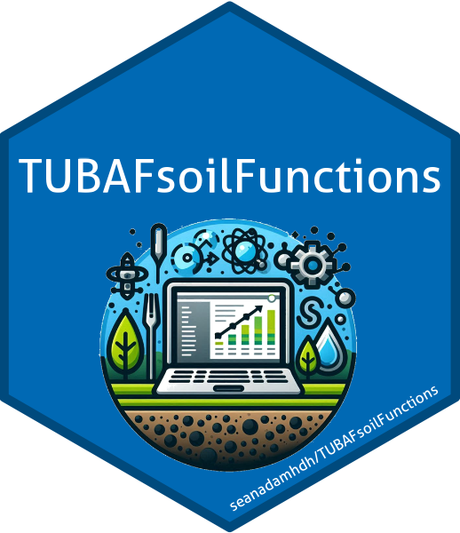

# TUBAFsoilFunctions 

## Installation

Install using
`remotes::install_github("seanadamhdh/TUBAFsoilFunctions")`.

Currently, packages are loaded lazy with (**import?**)`...` instead of
(**importFrom?**)`...`. If you are running on a deprecated version of R,
try skipping. It is planned to implement proper import handling at some
point, though, for now, you should be fine with R\>4.3 and package
versions from 2023 or newer. If you use legacy versions of the
r-packages used by this package, or R itself, you should be careful, as
a) Updates could break code written in older versions of R or use legacy
versions of package, and b) it might take quite a wile to update
everything. You might want to consider setting up a renv environment.

## Contents

This package contains an assortment of functions that I wrote during my
doctorate. This includes functions for processing data from several
laboratory and field instruments used by the soil working group at IBF,
TU Bergakademie Freiberg. Roughly, contents of this package can be
grouped into the following categories:

- Loading, processing, and cleaning of Elementar soliTOCcube data

- Loading, processing, and cleaning of Bruker Alpha DRIFTS data (heavily
  relying on Baumann (2020), Stevens and Ramirez-Lopez (2022), and
  Ramirez-Lopez et al. (2023))

- Loading, processing and cleaning of Spectrolyzer UV-Vis spectra

- Chemometric modelling with the caret Kuhn (2008) framework, including
  calibration, validation and application of models for midDRIFTS and
  UV-Vis data

- Loading, processing and cleaning (CO2) respiration data collected with
  SEMACHv3 chamber systems (also see `seanadamhdh/SEMACHv3` for a python
  single-file exe) and PriEco Pri8800 incubator data

- Assorted additional functions and helpers for smaller tasks, i.e., for
  soil profile data homogenisation, or sample label generator.

Baumann, Philipp. 2020. “Simplerspec: Soil and Plant Spectroscopic Model
Building and Prediction.”
<https://github.com/philipp-baumann/simplerspec>.

Kuhn, Max. 2008. “Building Predictive Models in r Using the Caret
Package.” *Journal of Statistical Software* 28 (5).
<https://doi.org/10.18637/jss.v028.i05>.

Ramirez-Lopez, Leonardo, Antoine Stevens, Claudio Orellano, Raphael
Viscarra Rossel, Zefang Shen, Alex Wadoux, and Timo Breure. 2023.
“Resemble: Regression and Similarity Evaluation for Memory-Based
Learning in Spectral Chemometrics.”
<https://cran.r-project.org/web/packages/resemble/index.html>.

Stevens, Antoine, and Leonardo Ramirez-Lopez. 2022. “An Introduction to
the Prospectr Package.”
<https://cran.r-project.org/web/packages/prospectr/index.html>.

